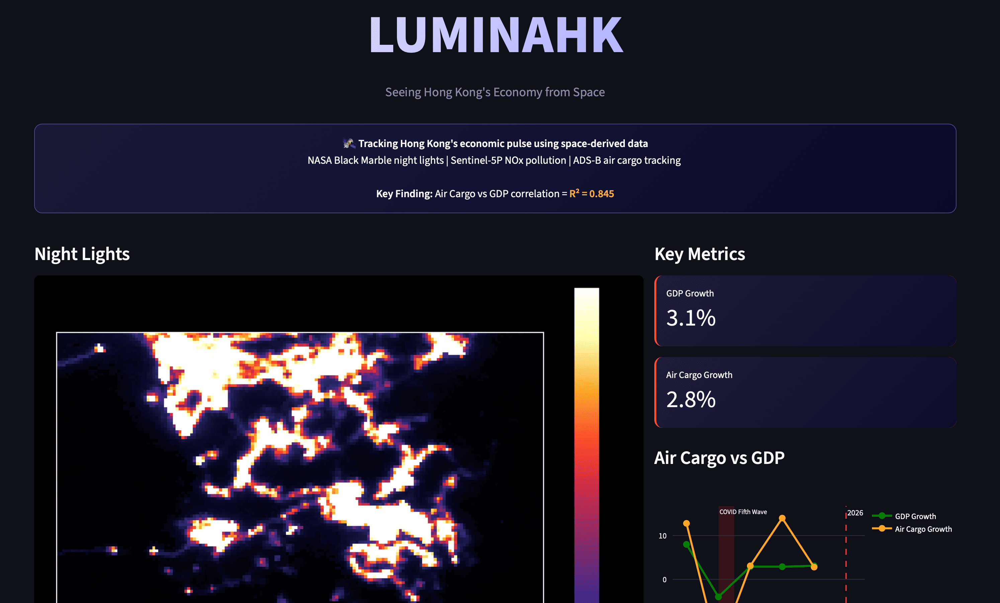
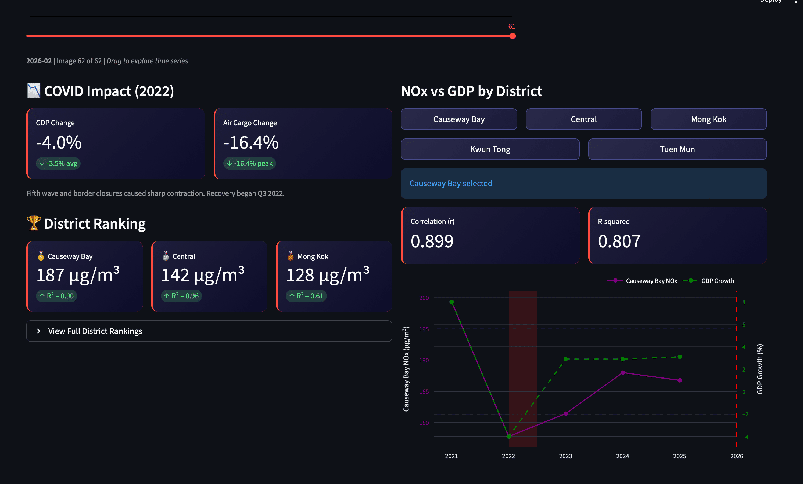
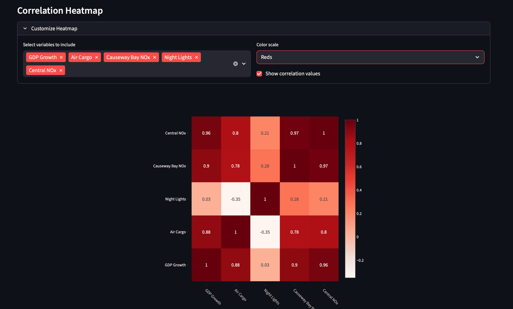
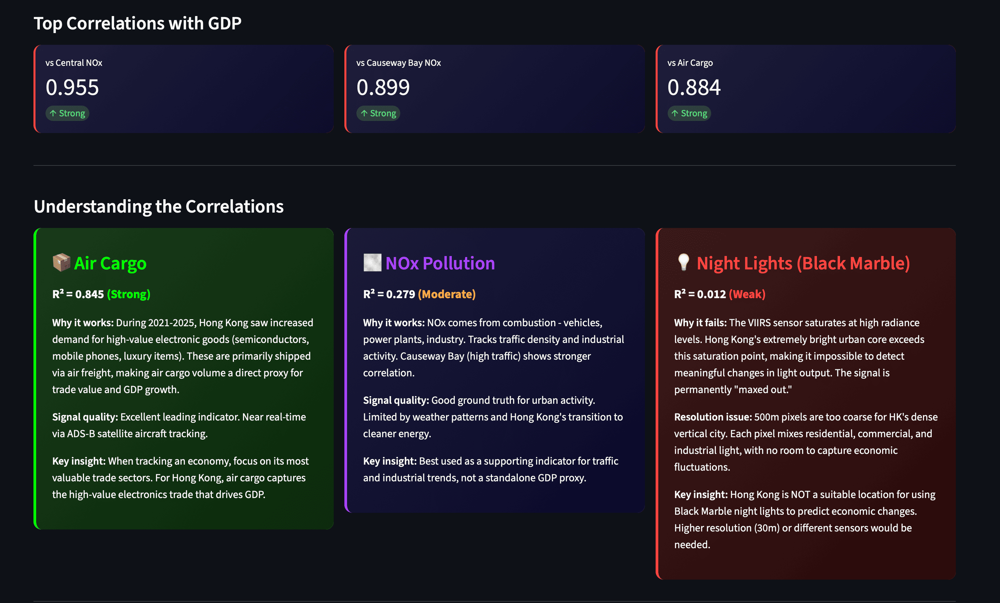
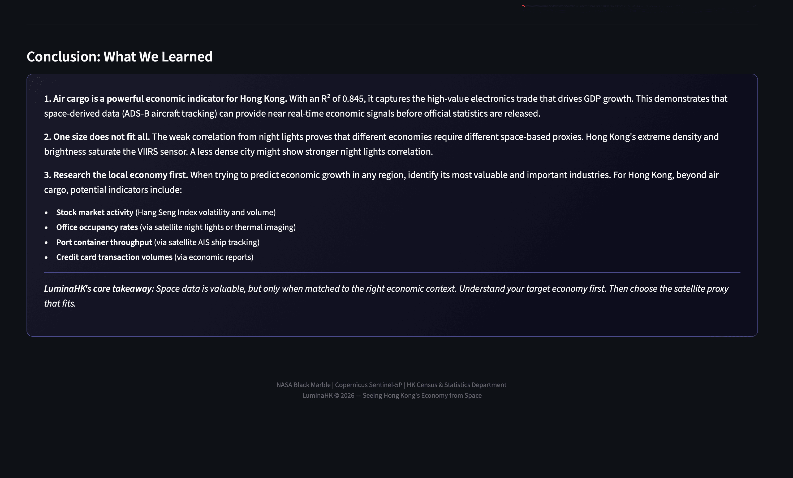

<div align="center">

# LuminaHK

**Seeing Hong Kong's Economy from Space**

</div>

LuminaHK is a data visualization platform that explores whether space-derived data can serve as a reliable proxy for economic activity in Hong Kong. By combining NASA Black Marble night lights, Sentinel-5P NOx pollution data, and air cargo statistics, we test which satellite-based indicators actually correlate with GDP growth.

## Dashboard Previews

| Night Lights & Key Metrics, Air Cargo vs GDP |
|----------------------------------------------|
| |

| NOx Analysis |
|-------------|
|  |

| Correlation Heatmap |
|--------------------|
|  |

| Insights |
|----------|
|  |

## What We Were Trying to Find

The core question: **Can we track Hong Kong's economic pulse from space?**

We tested three space-derived data sources against Hong Kong's quarterly GDP growth (2021-2025):

1. **Night Lights (NASA Black Marble)** - Urban brightness as economic activity proxy
2. **NOx Pollution (Sentinel-5P)** - Atmospheric nitrogen dioxide from combustion
3. **Air Cargo Volume** - High-value trade volume (tracked via satellite-enabled logistics)

## What We Found

| Indicator | Correlation (R²) | Strength |
|-----------|-----------------|----------|
| **Air Cargo** | 0.845 | Strong |
| **NOx Pollution** | 0.279 | Moderate |
| **Night Lights** | 0.012 | Weak |

### Key Insights

**Air cargo is an excellent GDP proxy for Hong Kong**
- R² = 0.845 — air cargo growth accounts for 84.5% of the variance in quarterly GDP growth
- During 2021-2025, Hong Kong saw surging demand for high-value electronics (semiconductors, mobile phones, luxury goods) — all shipped via air freight
- ADS-B satellite tracking makes this data available in near real-time

**NOx pollution works as a supporting indicator**
- Tracks traffic density and industrial activity
- Causeway Bay (high traffic) shows stronger correlation than residential areas
- Limited by weather patterns and Hong Kong's transition to cleaner energy

**Night lights FAIL in Hong Kong**
- R² of 0.012 — essentially no correlation
- **Why:** The VIIRS sensor saturates at high radiance levels. Hong Kong's ultra-bright urban core exceeds this saturation point, making it impossible to detect meaningful changes
- **Resolution issue:** 500m pixels are too coarse for HK's dense vertical city
- **Conclusion:** Hong Kong is NOT a suitable location for using Black Marble to predict economic changes

## What to Build On

### For Hong Kong:
- **Stock market activity** (Hang Seng Index volatility and volume)
- **Office occupancy rates** (via higher-resolution satellite imagery)
- **Port container throughput** (via satellite AIS ship tracking)
- **Credit card transaction volumes** (via economic reports)

### General Framework:
When trying to predict economic growth in any region:
1. **Research the local economy first** — identify its most valuable industries
2. **Match the satellite proxy to the industry** — air cargo for trade hubs, night lights for less dense cities, thermal for industrial activity
3. **Understand sensor limitations** — saturation, resolution, cloud cover, seasonality

### One-Size-Does-Not-Fit-All
The weak night lights correlation proves that different economies require different space-based proxies. What works in Hong Kong (air cargo) won't work in a rural agricultural economy. What works in a sprawling US suburb (night lights) won't work in a hyper-dense Asian metropolis.

## Tech Stack

- **Frontend:** Streamlit
- **Visualization:** Plotly
- **Data Processing:** Pandas, NumPy, H5Py
- **Data Sources:**
  - NASA Black Marble (VIIRS night lights)
  - Copernicus Sentinel-5P (NOx pollution)
  - HK Census & Statistics Department (GDP, air cargo)

## Running Locally

```bash
# Clone the repository
git clone https://github.com/Aurorcys/LuminaHK.git
cd LuminaHK

# Install dependencies
pip install streamlit pandas numpy plotly h5py pillow

# Run the dashboard
streamlit run streamlitapps/app.py
